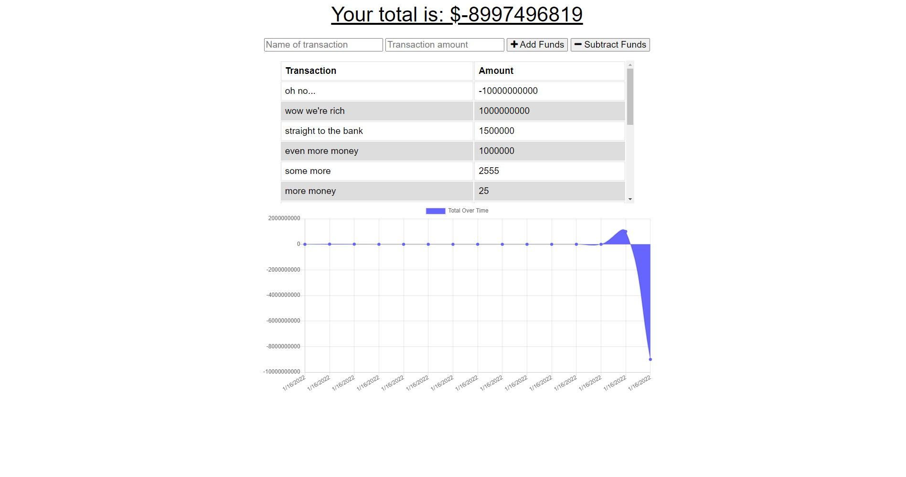

# Budget-Tracker

## Purpose:
An application used to track your budget wherever, whenever. Online or offline. And exercise in adding offline functionality via IndexedDB and Service Workers.

## Built With:
* JavaScript
* Node.js
* Express
* MongoDB
* Mongoose
* IndexedDB

## Deployed Link (currently not functioning correctly): https://pacific-beyond-51243.herokuapp.com/

## Contribution
Made with ❤️ by Zachary McCollum
